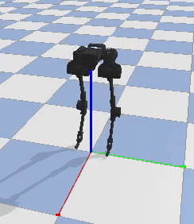

# BlackBird-gym



### Description

Blackbird is an open source, low-cost bipedal robot capable of high resolution force control. It is a research and education platform designed for college and post-grad students interested in studying the advanced field of robotics.  We have implemented multiple algorithms that allow the platform walk, run, spin, and jump based on modern reinforcement learning methods. Most of the design is 3D printed, which allows it to be easily manufactured by students and enthusiasts.In order to enhance the ease of experimentation with this robot we have built a gym-environment that would enable researchers to directly deploy their RL alogorithms without having to worry about building the simulation environment.The environment is built in Pybullet ,a python wrapper for the famous bullet 3d engine and all the implementation is in native python.

### Installation

Install the blackBird Env with `python3 -m pip install -e gym-blackBird`.
If errors arise, try: `python3 -m pip install --user -e gym-blackBird`


You can create an instance of the environment with `gym.make('gym_blackBird:blackBird-v0')`

Test the environment using : ```python3 BlackBird-gym/EnvTest.py ```

More details about the hardware implementation can be found at [here](https://hackaday.io/project/160882-blackbird-bipedal-robot)
